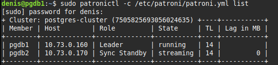
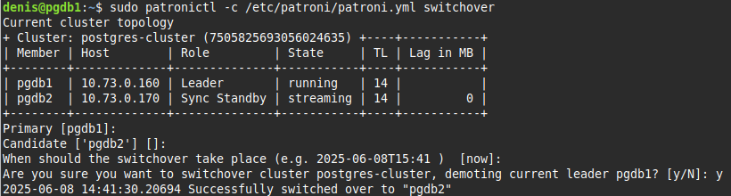
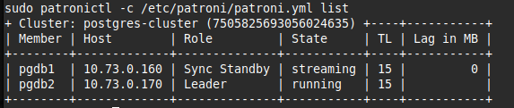
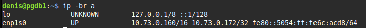
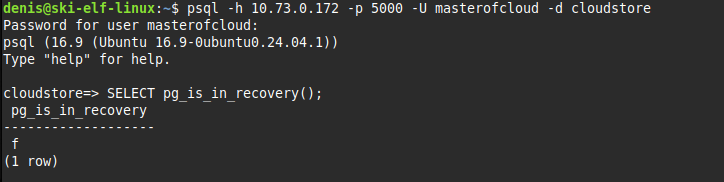
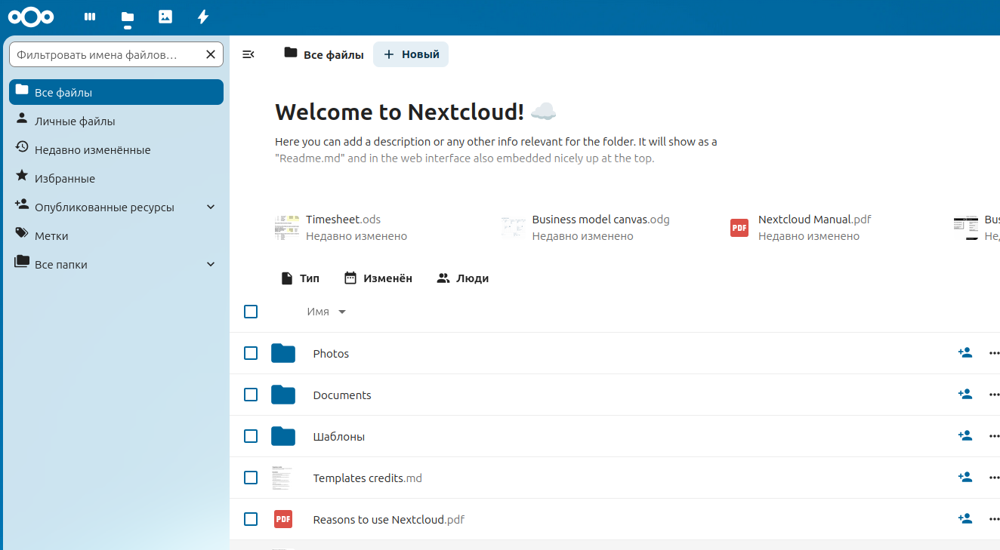
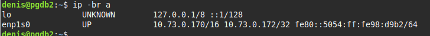
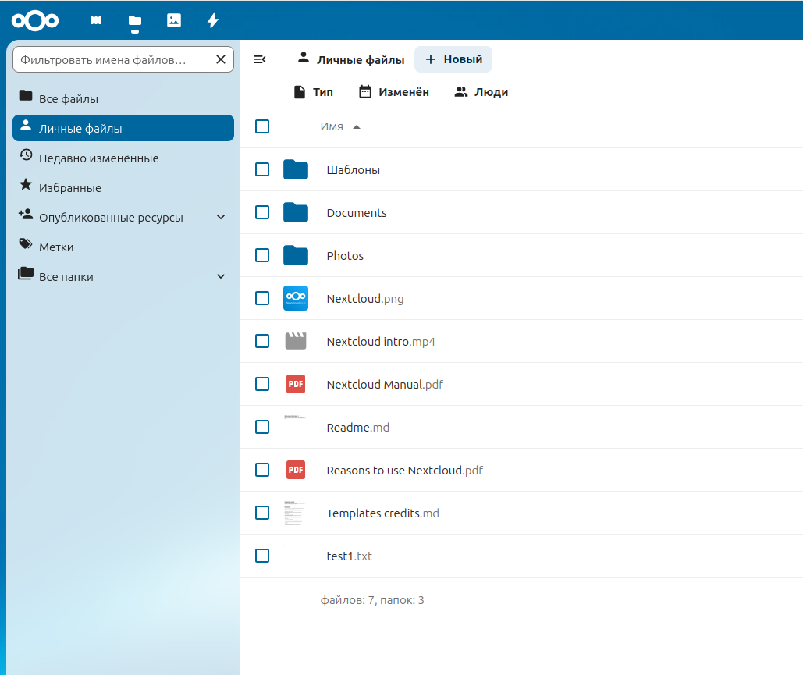
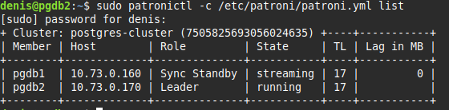

# Кластер высокой доступности Patroni

## Компоненты, входящие в кластер:

* СУБД PostgreSQL 16
* Распределенная БД etcd
* Прокси сервер HAProxy
* Сервис keepalived
* Система управления кластером Patroni

## Структура кластера

В кластер входят две ноды, на которых установлены:
* СУБД Postgres. 
* экземпляры etcd для хранения ключа лидера, 
* система управления кластером Patroni, осуществляющая назначение ролей master/replica
* Сервис keepalived, обеспечивающий использование вируального ip адреса кластера.
* Сервис haproxy, обеспечивающий подключение к мастер-ноде вне зависимости от того, какой ноде в данный момент принадлежит виртуальный ip адрес кластера.

 
Кроме того в кластер входит одна "кворумная" нода etcd.

## Имена и адреса нод в кластере:
* pgdb1, 10.73.0.160 - первая нода
* pgdb2 10.73.0.170 - вторая нода
* etcd1 10.73.0.171 - "кворумная" нода etcd
* 10.73.0.172 - виртуальный ip адрес кластера


[Конфигурационные файлы системы можно посмотреть по адресу: https://github.com/skiangel/Otus_Postgres-DBA-2025-01/tree/main/pg_diploma](https://github.com/skiangel/Otus_Postgres-DBA-2025-01/tree/main/pg_diploma)

Конфигурация предоставлена для первой ноды, для второй она отличается только адресацией, на "кворумной ноде", кроме этого, установлен только сервис etcd

## Пример эксплуатации

Смотрим состав кластера



Видим две ноды, при этом pgdb1 является мастером.
Произведем переключение мастера:



Еще раз посмотрим состав кластера:



Видим, что роль мастера переехала на вторую ноду, при этом виртуальный адрес кластера находится на первой ноде:



Попробуем подключиться к кластеру через виртуальный адрес, но используем порт 5000, который обслуживается haproxy, в результате видим, что сервер не в readonly, мы попали на мастера



В качестве клиента подключим к кластеру систему облачного хранения **Nextcloud**

[Система доступна по адресу https://datastore.daemony.ru](https://datastore.daemony.ru) 

В конфигурационном файле Nextcloud подключение выглядит следующим образом:

```bash
  'dbtype' => 'pgsql',
  'dbname' => 'cloudstore',
  'dbhost' => '10.73.0.172:5000',
  'dbport' => '5000',
  'dbtableprefix' => 'oc_',
  'dbuser' => 'MyCoolName_Ooops',
  'dbpassword' => 'Dont_you_wait_for_my_Password???',
```

Система работает



При переключении ролей работоспособность сохраняется.

Для проверки выключим первую ноду, на которой присутствует виртуальный ip адрес кластера
```bash
denis@pgdb1:~$ sudo shutdown -P now
```

Сразу же видим, что виртуальный адрес переместился на вторую ноду:



Прверяем, система работает, для проверки даливаю туда файл test1.txt, все в норме:



Включаем первую ноду, видим, что она вернулась в качестве реплики:




